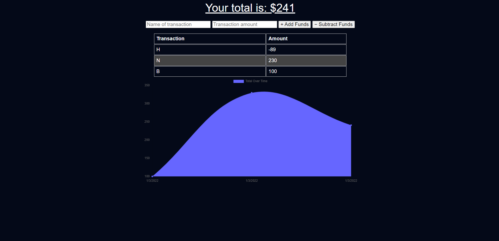

# ***Another Budget App***

[Click here to interact with live page](https://anotherbudgetapp.herokuapp.com)

# ***IMPORTANT***
***THIS IS NOT TAILORED TO EACH USER YET. DO NOT SHARE PERSONAL INFORMATION ON IT!***
#

## **Description**
This budget website is to allow the user to use and operate it whether offline or online. It moves so smooth between offline and online that you wouldn't know if it didn't alert you when the data gets sent to the server! Happy budgeting!
#
# ## _How to use_
* To add funds you must first type in the name of the transaction, then the amount and click `+ Add Funds` button.
* To subtract funds you must first type in the name of the transaction, then the amount and click `- Subtract Funds` button. 
#
## **How does it work?**
This app's database is MongoDB a NoSQL database to elegantly store the user's information that is submitted. It uses mongoose to communicate with MongoDB, and for offline use the app is operated with IndexedDB. This allows for a smooth transition from online-offline-online interactions.

The other part that allows you to still see the contents of the app even without internet is the service workers storing the data for the app's design and functionality. Of course, the files it needs to run are minimized for performance. This allows the app to keep the aesthetic appeal even when there is little to no internet connection. 